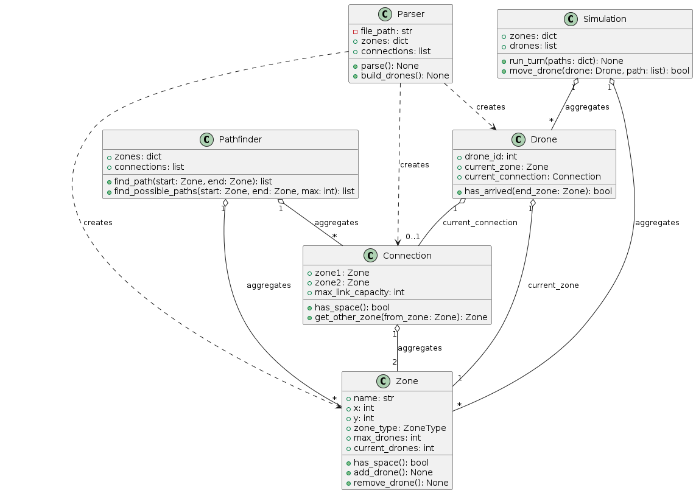
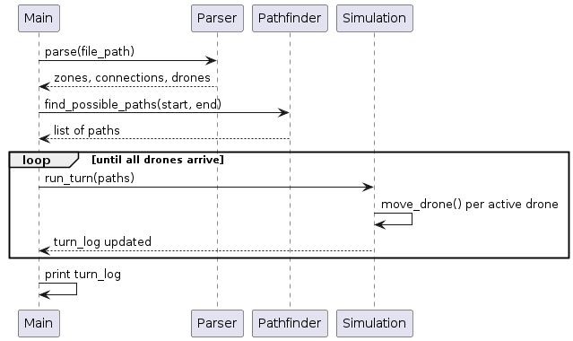
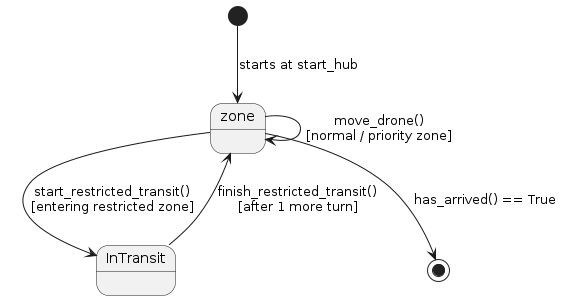

*This project has been created as part of the 42 curriculum by mjaad.*

# Fly-in

## Description

Fly-in is a drone routing simulator. It parses a map file describing zones
and connections between them, computes efficient routes with a
hand-implemented Dijkstra's algorithm, and simulates multiple drones
moving simultaneously from a start zone to an end zone while respecting
zone capacity, connection capacity, restricted-zone transit times, and
priority-zone preferences.

The project is fully object-oriented, uses no external graph libraries,
and is type-checked with `mypy` and linted with `flake8`.

## Instructions

**Requirements:** Python 3.10+, `pip`.

**Install:** `make install` — installs `flake8`/`mypy` from `requirements.txt`.

**Run:** `make run MAP=path/to/map.txt`, or directly: `python3 main.py path/to/map.txt`.

**Other targets:** `make debug` (runs via `pdb`), `make clean` (removes caches),
`make lint` (required flags), `make lint-strict` (`mypy --strict`).

## Resources

- [Red Blob Games — Introduction to A\*](https://www.redblobgames.com/pathfinding/a-star/introduction.html) — used to compare Dijkstra and A* before choosing between them.
- [Wikipedia — Dijkstra's algorithm](https://en.wikipedia.org/wiki/Dijkstra%27s_algorithm) — confirmed correctness conditions (non-negative weights).
- [Python docs — `heapq`](https://docs.python.org/3/library/heapq.html) — confirmed the `(cost, counter, item)` tie-breaking pattern.

### AI usage

Claude (Anthropic) was used as a tutor throughout, not as a code generator:
explaining concepts (config-vs-state split, `mypy`'s Optional-narrowing,
Dijkstra's mechanics) while I wrote every line myself; reviewing my code to
point out real bugs (a missing `connection.add_drone()` call, a capacity
check that ignored drones already en route); running my code against
constructed test maps to verify claims empirically; and stress-testing the
parser against malformed input I proposed, so each gap found a
clear, line-numbered error instead of a raw traceback. No code was used
without being typed and understood by hand first.

## Algorithm Explanation and Implementation Strategy

**Graph representation:** Zones and connections are plain hand-written
objects (`Zone`, `Connection`) — no graph library. `Connection` stores
direct references to its two `Zone` objects, forming a simple object
graph.

**Pathfinding:** Dijkstra's algorithm (`Pathfinder.find_path`), using
`heapq` with `(cost, counter, zone)` tuples for safe tie-breaking.
Chosen over BFS (assumes uniform cost, incorrect since `restricted`
costs 2 turns) and A* (unnecessary heuristic risk at this scale). If no
path exists, `find_path` returns an empty list and the caller raises a
clear error rather than crashing later. `priority` zones cost the same
as `normal` (1 turn) — "preferred" is implemented as a tie-break: when
routes tie on cost, the priority-containing route is sorted first.

**Multi-path distribution:** `find_possible_paths` finds the cheapest
route, then tries blocking each of its connections one at a time to
discover genuinely different, equal-or-cheaper alternatives. Drones are
assigned to the resulting routes round-robin, so equally-good paths run
in parallel instead of bottlenecking on one.

**Turn-based simulation:** Each turn, every drone attempts one move.
`can_move` checks zone and connection capacity together, including
drones already **en route** to a zone (not just those already there),
to avoid overflowing capacity on arrival.

**Restricted-zone transit:** Takes 2 turns. A drone mid-transit is
tracked via `current_connection`/`target_zone`/`turns_remaining` rather
than moving instantly, and the output correctly shows the connection
name while in flight.

**Parser hardening:** Beyond the happy path, the parser rejects
malformed, duplicate, or self-referential input (duplicate/invalid zone
names, unbalanced metadata, undefined or duplicate connections, a
blocked start/end zone, wrong first line, unreadable files, and more),
every error reporting its exact line number.

**Known limitation:** An "exit-before-entry" fairness edge case exists —
a drone entering a zone the same turn another leaves can be delayed one
extra turn if checked first. This was tested directly against the full
simulation and found very unlikely to trigger, given drones are always
processed in a consistent order. It causes no crashes or invalid state,
only an occasional extra turn, and was deliberately left as a
documented trade-off given the time available.

## Visual Representation

Colored terminal output: each zone's `color` metadata tints its name in
the turn log via ANSI codes. During restricted-zone transit, both zone
names in the connection label are colored independently, making it easy
to track which zone type a drone occupies or crosses each turn.

## Architecture Diagrams

### Class diagram



### Sequence diagram


### Drone state diagram


## Example

```
nb_drones: 4
start_hub: start 0 0 [color=green]
hub: junction 1 0 [color=yellow max_drones=2]
hub: path_a 2 1 [color=blue]
hub: path_b 2 -1 [color=blue]
end_hub: goal 3 0 [color=red]
connection: start-junction [max_link_capacity=2]
connection: junction-path_a
connection: junction-path_b
connection: path_a-goal
connection: path_b-goal
```

`python3 main.py maps/easy/02_simple_fork.txt` produces:

```
D1-junction D2-junction
D1-path_a D2-path_b D3-junction D4-junction
D1-goal D2-goal D3-path_a D4-path_b
D3-goal D4-goal
```

All 4 drones reach `goal` in 4 turns, distributed across both paths in
parallel rather than queuing on one.

**Error handling example** — given `hub: roof-1 3 4` on line 3 of a map:

```
Error: Line (3): Invalid zone name 'roof-1': dashes are not allowed.
```